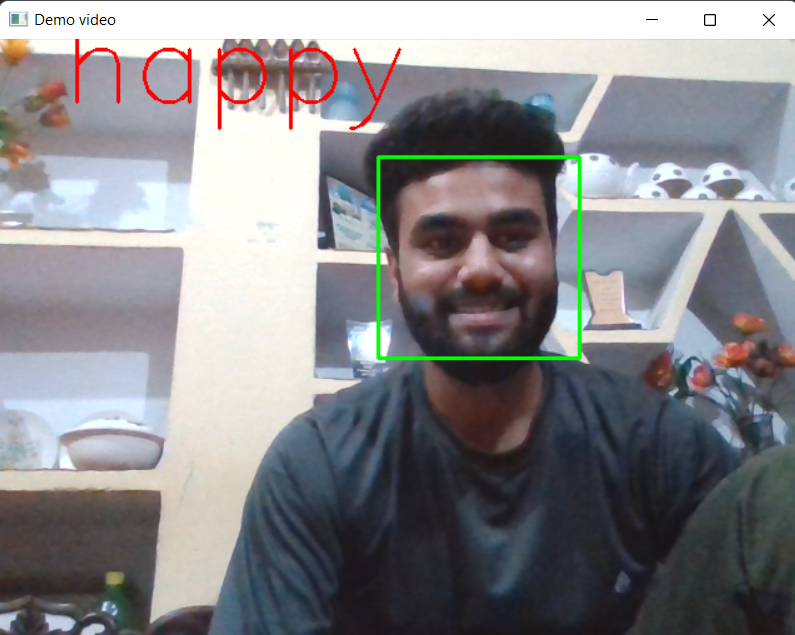
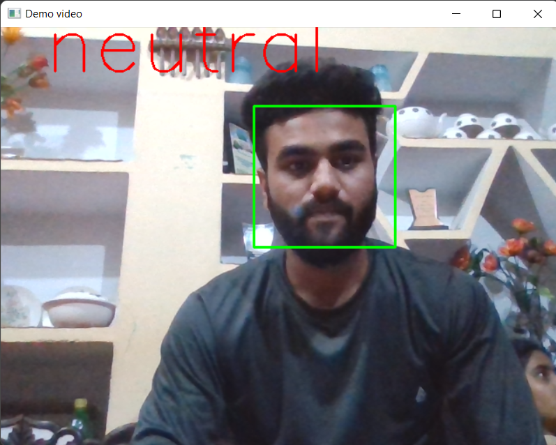
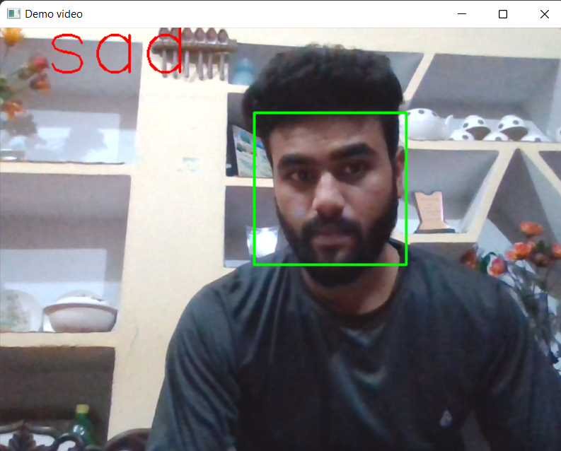

# **Computer Vision**
this readme file contains projects and learning material for openCv.

# Requirments :
* Install Python 3.7.6
    * Install using link :
        * For Window user : https://www.python.org/ftp/python/3.7.6/python-3.7.6-amd64.exe
        * For Mac User  : https://www.python.org/ftp/python/3.7.6/python-3.7.6-macosx10.9.pkg
* Install Jupyter Notebook
    * Run this Command in Command prompt :
        * pip install jupyter notebook
* Install Mediapipe
    * Run the following command in jupyter notebook cell
         * !pip install mediapipe --user
* install pydirectinput (for Hill Climb and temple run automation)
    * Run the command in jupyter notebook cell :
         * !pip install pydirectinput

         

**-----------------------------------------------------------------------------------------------------------------**
    
* # [Air Drum : ](https://github.com/Aswanurrehman/Computer_Vision_Projects/tree/main/AirDrum) 
*    ## In this project, I use OpenCV to create a virtual drum set using fundamental computer vision techniques.

* Open jupyter notebook and run the program.

`Blue and Red sticks are needed because I have used a detection window that would detect the color Blue and red.`

**output**

  

  

**-----------------------------------------------------------------------------------------------------------------**
  

* # [Emotion Detection : ](https://github.com/Aswanurrehman/Computer_Vision_Projects/tree/main/EmotionDetection)

    
**some output pic**

Happy 😀
  

  

Neutral 🙂
  

  
    
Sad 😔

  

  